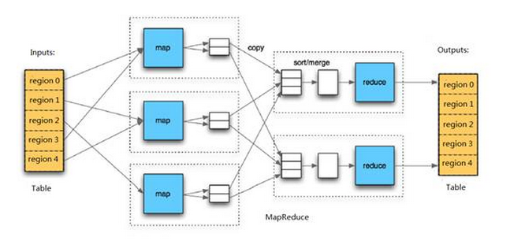
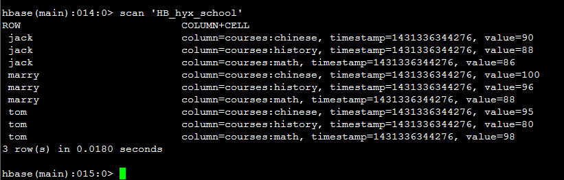
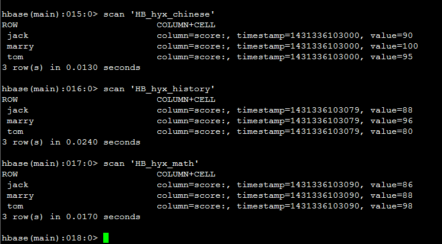

# HBase MapReduce 操作

> 目录
> 
> - [概述](https://github.com/Chinaxiang/blog/blob/master/Java/HBase/useHBaseMapReduce.md#%E6%A6%82%E8%BF%B0)
> - [读文件到HBase中](https://github.com/Chinaxiang/blog/blob/master/Java/HBase/useHBaseMapReduce.md#%E8%AF%BB%E6%96%87%E4%BB%B6%E5%88%B0hbase%E4%B8%AD)
>     - [准备测试数据](https://github.com/Chinaxiang/blog/blob/master/Java/HBase/useHBaseMapReduce.md#%E5%87%86%E5%A4%87%E6%B5%8B%E8%AF%95%E6%95%B0%E6%8D%AE)
>     - [HBase表设计](https://github.com/Chinaxiang/blog/blob/master/Java/HBase/useHBaseMapReduce.md#hbase%E8%A1%A8%E8%AE%BE%E8%AE%A1)
>     - [MapReduce 实例一](https://github.com/Chinaxiang/blog/blob/master/Java/HBase/useHBaseMapReduce.md#mapreduce-%E5%AE%9E%E4%BE%8B%E4%B8%80)
>     - [MapReduce 实例二](https://github.com/Chinaxiang/blog/blob/master/Java/HBase/useHBaseMapReduce.md#mapreduce-%E5%AE%9E%E4%BE%8B%E4%BA%8C)
>     - [MapReduce 实例三](https://github.com/Chinaxiang/blog/blob/master/Java/HBase/useHBaseMapReduce.md#mapreduce-%E5%AE%9E%E4%BE%8B%E4%B8%89)
> - [读文件到多个HBase中](https://github.com/Chinaxiang/blog/blob/master/Java/HBase/useHBaseMapReduce.md#%E8%AF%BB%E6%96%87%E4%BB%B6%E5%88%B0%E5%A4%9A%E4%B8%AAhbase%E4%B8%AD)
>     - [HBase表设计](https://github.com/Chinaxiang/blog/blob/master/Java/HBase/useHBaseMapReduce.md#hbase%E8%A1%A8%E8%AE%BE%E8%AE%A1-1)
>     - [MapReduce 实例四](https://github.com/Chinaxiang/blog/blob/master/Java/HBase/useHBaseMapReduce.md#mapreduce-%E5%AE%9E%E4%BE%8B%E5%9B%9B)
> - [从HBase中读取数据到文件](https://github.com/Chinaxiang/blog/blob/master/Java/HBase/useHBaseMapReduce.md#%E4%BB%8Ehbase%E4%B8%AD%E8%AF%BB%E5%8F%96%E6%95%B0%E6%8D%AE%E5%88%B0%E6%96%87%E4%BB%B6)
>     - [MapReduce 实例五](https://github.com/Chinaxiang/blog/blob/master/Java/HBase/useHBaseMapReduce.md#mapreduce-%E5%AE%9E%E4%BE%8B%E4%BA%94)
>     - [MapReduce 实例六](https://github.com/Chinaxiang/blog/blob/master/Java/HBase/useHBaseMapReduce.md#mapreduce-%E5%AE%9E%E4%BE%8B%E5%85%AD)
> - [从多个HBase中读数据到文件](https://github.com/Chinaxiang/blog/blob/master/Java/HBase/useHBaseMapReduce.md#%E4%BB%8E%E5%A4%9A%E4%B8%AAhbase%E4%B8%AD%E8%AF%BB%E6%95%B0%E6%8D%AE%E5%88%B0%E6%96%87%E4%BB%B6)
>     - [MapReduce 实例七](https://github.com/Chinaxiang/blog/blob/master/Java/HBase/useHBaseMapReduce.md#mapreduce-%E5%AE%9E%E4%BE%8B%E4%B8%83)
> - [参考资料](https://github.com/Chinaxiang/blog/blob/master/Java/HBase/useHBaseMapReduce.md#%E5%8F%82%E8%80%83%E8%B5%84%E6%96%99)

环境：

- Hadoop 2.0.0-cdh4.3.0
- Hbase-0.94.6-cdh4.3.0
- JDK 1.6

## 概述

HBase – Hadoop Database，是一个高可靠性、高性能、面向列、可伸缩的分布式存储系统，在HBase系统上运行批处理运算，最方便和实用的模型依然是MapReduce。



HBase Table和Region的关系，比较类似HDFS File和Block的关系，HBase提供了配套的 `TableInputFormat` 和 `TableOutputFormat` API，可以方便的将HBase Table作为Hadoop MapReduce的Source和Sink，对于MapReduce Job应用开发人员来说，基本不需要关注HBase系统自身的细节。

## 读文件到HBase中

使用MapReduce读取HDFS中文件写入到HBase中。

### 准备测试数据

建立 course.txt 文件，内容如下( `\t` ( `tab` )分隔)：

	tom	math	98
	tom	chinese	95
	tom	history	80
	jack	math	86
	jack	history	88
	jack	chinese	90
	marry	math	88
	marry	history	96
	marry	chinese	100

放置到 HDFS 中，这里是：`/user/panda/input/course.txt`

### HBase表设计

建表：

- 表名：`HB_hyx_school`  
- 列族：`courses`

最终想要得到的结果应该为：

<table>
<tr>
<th>row</th><th>courses</th>
</tr>
<tr>
<td>tom</td><td>math:98</td>
</tr>
<tr>
<td>tom</td><td>chinese:95</td>
</tr>
<tr>
<td>tom</td><td>history:80</td>
</tr>
<tr>
<td>jack</td><td>math:86</td>
</tr>
<tr>
<td>jack</td><td>history:88</td>
</tr>
<tr>
<td>jack</td><td>chinese:90</td>
</tr>
<tr>
<td>marry</td><td>math:88</td>
</tr>
<tr>
<td>marry</td><td>history:96</td>
</tr>
<tr>
<td>marry</td><td>chinese:100</td>
</tr>
</table>

### MapReduce 实例一

代码示例：

```java
import java.io.IOException;
import java.security.PrivilegedExceptionAction;
import java.util.Date;

import org.apache.hadoop.conf.Configuration;
import org.apache.hadoop.fs.Path;
import org.apache.hadoop.hbase.client.Put;
import org.apache.hadoop.hbase.mapreduce.TableMapReduceUtil;
import org.apache.hadoop.hbase.mapreduce.TableReducer;
import org.apache.hadoop.hbase.util.Bytes;
import org.apache.hadoop.io.LongWritable;
import org.apache.hadoop.io.NullWritable;
import org.apache.hadoop.io.Text;
import org.apache.hadoop.mapreduce.Job;
import org.apache.hadoop.mapreduce.Mapper;
import org.apache.hadoop.mapreduce.lib.input.FileInputFormat;
import org.apache.hadoop.security.UserGroupInformation;

import com.dragon.core.utils.DateUtils;
import com.dragon.main.common.utils.HadoopUtils;

/**
 * @author panda
 */
public class ReadHDFSToHBase {

	public static class MapOne extends Mapper<LongWritable, Text, Text, Text> {

		@Override
		protected void map(LongWritable key, Text value, Context context) throws IOException, InterruptedException {
			String[] vals = value.toString().split("\t");
			if (vals.length == 3) {
				String name = vals[0];
				String course = vals[1];
				String score = vals[2];
				context.write(new Text(name), new Text(course + "\t" + score));
			}
		};
	}

	public static class ReduceOne extends TableReducer<Text, Text, NullWritable> {

		@Override
		protected void reduce(Text key, Iterable<Text> values, Context context) throws IOException, InterruptedException {
			String row = key.toString();
			String family = "courses";
			byte[] familyB = Bytes.toBytes(family);
			Put put = new Put(Bytes.toBytes(row));
			for (Text text : values) {
				String[] vals = text.toString().split("\t");
				if (vals.length == 2) {
					String qualifier = vals[0];
					String value = vals[1];
					byte[] qualifierB = Bytes.toBytes(qualifier);
					byte[] valueB = Bytes.toBytes(value);
					put.add(familyB, qualifierB, valueB);
				}
			}
			if (!put.isEmpty()) {
				context.write(NullWritable.get(), put);
			}

		};

	}

	public static void runJob() throws Exception {
		Configuration conf = HadoopUtils.getDragonHbaseConfiguration();
		String input = "/user/panda/input/course.txt";
		try {
			Job jobOne = new Job(conf, "Dragon ReadHDFSToHBase Job 1 - " + DateUtils.format2date(new Date(), "yyyy-MM-dd HH:mm:ss"));
			jobOne.setJarByClass(ReadHDFSToHBase.class);
			jobOne.setMapperClass(MapOne.class);
			jobOne.setReducerClass(ReduceOne.class);
			jobOne.setNumReduceTasks(8);
			jobOne.setMapOutputKeyClass(Text.class);
			jobOne.setMapOutputValueClass(Text.class);
			FileInputFormat.addInputPath(jobOne, new Path(input));
			TableMapReduceUtil.initTableReducerJob("HB_hyx_school", ReduceOne.class, jobOne);
			jobOne.waitForCompletion(true);
		} catch (Exception e) {
			System.out.println("出现异常了");
		} finally {

		}

	}

	public static void main(final String[] args) throws IOException, InterruptedException {

		UserGroupInformation ugi = UserGroupInformation.createRemoteUser("panda");
		ugi.doAs(new PrivilegedExceptionAction<Void>() {
			@Override
			public Void run() throws Exception {
				runJob();
				return null;
			}
		});
	}

}
```

运行结果：



**注** 此代码非通用，但核心内容是可以借鉴的，下面分解介绍。

MapOne 读入文件，无需过多介绍，输出的 Key 为 name 是根据我们的业务需求决定的，因为我们的每一行就是一个人嘛。

ReduceOne 是本例的重点之一，我们采用继承 `TableReducer` 抽象类来向 HBase 中写数据：

	@InterfaceAudience.Public
	@InterfaceStability.Stable
	public abstract class TableReducer<KEYIN,VALUEIN,KEYOUT>
	extends org.apache.hadoop.mapreduce.Reducer<KEYIN,VALUEIN,KEYOUT,Mutation>

KEYIN, VALUEIN 对应 MapOne 的输出 Key 和输出 Value, KEYOUT 对于下面要讲到的多表输出有用，此字段是用来指定表名的，对于单表输出的表是在 Job 中指定的，所以此处为 NULL.

向 HBase 插数据当然是输出 Put 对象喽，一个 Put 实例代表一行。

	Put put = new Put(Bytes.toBytes(row));

输出嘛，将 Put 实例 write 出去。

	context.write(NullWritable.get(), put);

Job 部分核心部分其实就一行：

	TableMapReduceUtil.initTableReducerJob("HB_hyx_school", ReduceOne.class, jobOne);

指定输出到哪个表，使用哪个 Reducer。

至此，我们完成了从HDFS读取文件输出到HBase的简单操作。

### MapReduce 实例二

实例一中没有用到 TableOutputFormat 呀？那是因为  `TableMapReduceUtil.initTableReducerJob` 方法替我们完成了所有的配置，实例一中完整的 Job 是这样的：

	// ...
	jobOne.setNumReduceTasks(1);
	jobOne.setMapOutputKeyClass(Text.class);
	jobOne.setMapOutputValueClass(Text.class);
	// 可以省略的三行
	jobOne.setOutputKeyClass(NullWritable.class);
	jobOne.setOutputValueClass(Put.class);
	jobOne.setOutputFormatClass(TableOutputFormat.class);
	
	FileInputFormat.addInputPath(jobOne, new Path(input));
	TableMapReduceUtil.initTableReducerJob("HB_hyx_school", ReduceOne.class, jobOne);
	// ...

能省略的，谁愿意写呀，但是本例中是不能省略的哟。

代码如下：

	import java.io.IOException;
	import java.security.PrivilegedExceptionAction;
	import java.util.Date;
	
	import org.apache.hadoop.conf.Configuration;
	import org.apache.hadoop.fs.Path;
	import org.apache.hadoop.hbase.client.Put;
	import org.apache.hadoop.hbase.mapreduce.TableMapReduceUtil;
	import org.apache.hadoop.hbase.mapreduce.TableOutputFormat;
	import org.apache.hadoop.hbase.mapreduce.TableReducer;
	import org.apache.hadoop.hbase.util.Bytes;
	import org.apache.hadoop.io.LongWritable;
	import org.apache.hadoop.io.NullWritable;
	import org.apache.hadoop.io.Text;
	import org.apache.hadoop.mapreduce.Job;
	import org.apache.hadoop.mapreduce.Mapper;
	import org.apache.hadoop.mapreduce.lib.input.FileInputFormat;
	import org.apache.hadoop.security.UserGroupInformation;
	
	import com.dragon.core.utils.DateUtils;
	import com.dragon.main.common.utils.HadoopUtils;
	
	/**
	 * @author panda
	 */
	public class ReadHDFSToHBase {
	
		public static class MapOne extends Mapper<LongWritable, Text, Text, Text> {
	
			@Override
			protected void map(LongWritable key, Text value, Context context) throws IOException, InterruptedException {
				String[] vals = value.toString().split("\t");
				if (vals.length == 3) {
					String name = vals[0];
					String course = vals[1];
					String score = vals[2];
					context.write(new Text(name), new Text(course + "\t" + score));
				}
			};
		}
		
		public static class ReduceOne extends TableReducer<Text, Text, NullWritable> {
	
			@Override
			protected void reduce(Text key, Iterable<Text> values, Context context) throws IOException, InterruptedException {
				String row = key.toString();
				String family = "courses";
				byte[] familyB = Bytes.toBytes(family);
				Put put = new Put(Bytes.toBytes(row));
				for (Text text : values) {
					String[] vals = text.toString().split("\t");
					if (vals.length == 2) {
						String qualifier = vals[0];
						String value = vals[1];
						byte[] qualifierB = Bytes.toBytes(qualifier);
						byte[] valueB = Bytes.toBytes(value);
						put.add(familyB, qualifierB, valueB);
					}
				}
				if (!put.isEmpty()) {
					context.write(NullWritable.get(), put);
				}
	
			};
	
		}
	
		public static void runJob() throws Exception {
			Configuration conf = HadoopUtils.getDragonHbaseConfiguration();
			String input = "/user/panda/input/course.txt";
			try {
				// 单独使用 TableOutputFormat 必须在 Job 定义前指定 TableOutputFormat.OUTPUT_TABLE
				conf.set(TableOutputFormat.OUTPUT_TABLE, "HB_hyx_school");
				
				Job jobOne = new Job(conf, "Dragon ReadHDFSToHBase Job 1 - " + DateUtils.format2date(new Date(), "yyyy-MM-dd HH:mm:ss"));
				jobOne.setJarByClass(ReadHDFSToHBase.class);
				jobOne.setMapperClass(MapOne.class);
				jobOne.setReducerClass(ReduceOne.class);
				jobOne.setNumReduceTasks(1);
				jobOne.setMapOutputKeyClass(Text.class);
				jobOne.setMapOutputValueClass(Text.class);
				// 可以省略的俩行
				jobOne.setOutputKeyClass(NullWritable.class);
				jobOne.setOutputValueClass(Put.class);
				
				jobOne.setOutputFormatClass(TableOutputFormat.class);
				FileInputFormat.addInputPath(jobOne, new Path(input));
				// 普通Job不会自动加载HBase运行环境，需主动添加如下依赖
				TableMapReduceUtil.addDependencyJars(jobOne);
				TableMapReduceUtil.addDependencyJars(jobOne.getConfiguration());
				
				jobOne.waitForCompletion(true);
				
			} catch (Exception e) {
				System.out.println("出现异常了");
			} finally {
	
			}
	
		}
	
		public static void main(final String[] args) throws IOException, InterruptedException {
	
			UserGroupInformation ugi = UserGroupInformation.createRemoteUser("panda");
			ugi.doAs(new PrivilegedExceptionAction<Void>() {
				@Override
				public Void run() throws Exception {
					runJob();
					return null;
				}
			});
		}
	
	}

我们在本例中没有使用 `initTableReducerJob` 方法，而是使用了基于配置指定表的方法，具体请看实例中的注释。

### MapReduce 实例三

输出到 HBase 一定要用 TableReducer 吗？答案当然是否定的， TableReducer 也是继承自 Reducer 嘛，使用 Reducer 也是可以的。

代码如下：

	import java.io.IOException;
	import java.security.PrivilegedExceptionAction;
	import java.util.Date;
	
	import org.apache.hadoop.conf.Configuration;
	import org.apache.hadoop.fs.Path;
	import org.apache.hadoop.hbase.client.Put;
	import org.apache.hadoop.hbase.mapreduce.TableMapReduceUtil;
	import org.apache.hadoop.hbase.mapreduce.TableOutputFormat;
	import org.apache.hadoop.hbase.util.Bytes;
	import org.apache.hadoop.io.LongWritable;
	import org.apache.hadoop.io.NullWritable;
	import org.apache.hadoop.io.Text;
	import org.apache.hadoop.mapreduce.Job;
	import org.apache.hadoop.mapreduce.Mapper;
	import org.apache.hadoop.mapreduce.Reducer;
	import org.apache.hadoop.mapreduce.lib.input.FileInputFormat;
	import org.apache.hadoop.security.UserGroupInformation;
	
	import com.dragon.core.utils.DateUtils;
	import com.dragon.main.common.utils.HadoopUtils;
	
	/**
	 * @author panda
	 */
	public class ReadHDFSToHBase {
	
		public static class MapOne extends Mapper<LongWritable, Text, Text, Text> {
	
			@Override
			protected void map(LongWritable key, Text value, Context context) throws IOException, InterruptedException {
				String[] vals = value.toString().split("\t");
				if (vals.length == 3) {
					String name = vals[0];
					String course = vals[1];
					String score = vals[2];
					context.write(new Text(name), new Text(course + "\t" + score));
				}
			};
		}
		
		// 仅改动这一行
		public static class ReduceOne extends Reducer<Text, Text, NullWritable, Put> {
	//	public static class ReduceOne extends TableReducer<Text, Text, NullWritable> {
	
			@Override
			protected void reduce(Text key, Iterable<Text> values, Context context) throws IOException, InterruptedException {
				String row = key.toString();
				String family = "courses";
				byte[] familyB = Bytes.toBytes(family);
				Put put = new Put(Bytes.toBytes(row));
				for (Text text : values) {
					String[] vals = text.toString().split("\t");
					if (vals.length == 2) {
						String qualifier = vals[0];
						String value = vals[1];
						byte[] qualifierB = Bytes.toBytes(qualifier);
						byte[] valueB = Bytes.toBytes(value);
						put.add(familyB, qualifierB, valueB);
					}
				}
				if (!put.isEmpty()) {
					context.write(NullWritable.get(), put);
				}
	
			};
	
		}
	
		public static void runJob() throws Exception {
			Configuration conf = HadoopUtils.getDragonHbaseConfiguration();
			String input = "/user/panda/input/course.txt";
			try {
				// 单独使用 TableOutputFormat 必须在 Job 定义前指定 TableOutputFormat.OUTPUT_TABLE
				conf.set(TableOutputFormat.OUTPUT_TABLE, "HB_hyx_school");
				
				Job jobOne = new Job(conf, "Dragon ReadHDFSToHBase Job 1 - " + DateUtils.format2date(new Date(), "yyyy-MM-dd HH:mm:ss"));
				jobOne.setJarByClass(ReadHDFSToHBase.class);
				jobOne.setMapperClass(MapOne.class);
				jobOne.setReducerClass(ReduceOne.class);
				jobOne.setNumReduceTasks(1);
				jobOne.setMapOutputKeyClass(Text.class);
				jobOne.setMapOutputValueClass(Text.class);
				// 可以省略的俩行
				jobOne.setOutputKeyClass(NullWritable.class);
				jobOne.setOutputValueClass(Put.class);
				
				jobOne.setOutputFormatClass(TableOutputFormat.class);
				FileInputFormat.addInputPath(jobOne, new Path(input));
				// 普通Job不会自动加载HBase运行环境，需主动添加如下依赖
				TableMapReduceUtil.addDependencyJars(jobOne);
				TableMapReduceUtil.addDependencyJars(jobOne.getConfiguration());
				
				jobOne.waitForCompletion(true);
				
			} catch (Exception e) {
				System.out.println("出现异常了");
			} finally {
	
			}
	
		}
	
		public static void main(final String[] args) throws IOException, InterruptedException {
	
			UserGroupInformation ugi = UserGroupInformation.createRemoteUser("panda");
			ugi.doAs(new PrivilegedExceptionAction<Void>() {
				@Override
				public Void run() throws Exception {
					runJob();
					return null;
				}
			});
		}
	
	}

改动就一行，就是如此简单，不过值得注意的是，使用 Reducer 时 Job 中不能使用 `initTableReducerJob` 快速配置了，因为此方法需要 `TableReducer` 类作为参数。

## 读文件到多个HBase中

还是上面的数据，我们改变需求了，我要为每个学科建一个表。

### HBase表设计

数学表：

- 表名：`HB_hyx_math`
- 列族：`score`

语文表：

- 表名：`HB_hyx_chinese`
- 列族：`score`

历史表：

- 表名：`HB_hyx_history`
- 列族：`score`

我们要获得的结果你应该可以猜到了。

### MapReduce 实例四

代码如下：

	import java.io.IOException;
	import java.security.PrivilegedExceptionAction;
	import java.util.Date;
	
	import org.apache.hadoop.conf.Configuration;
	import org.apache.hadoop.fs.Path;
	import org.apache.hadoop.hbase.client.Put;
	import org.apache.hadoop.hbase.io.ImmutableBytesWritable;
	import org.apache.hadoop.hbase.mapreduce.MultiTableOutputFormat;
	import org.apache.hadoop.hbase.mapreduce.TableMapReduceUtil;
	import org.apache.hadoop.hbase.mapreduce.TableReducer;
	import org.apache.hadoop.hbase.util.Bytes;
	import org.apache.hadoop.io.LongWritable;
	import org.apache.hadoop.io.Text;
	import org.apache.hadoop.mapreduce.Job;
	import org.apache.hadoop.mapreduce.Mapper;
	import org.apache.hadoop.mapreduce.lib.input.FileInputFormat;
	import org.apache.hadoop.security.UserGroupInformation;
	
	import com.dragon.core.utils.DateUtils;
	import com.dragon.main.common.utils.HadoopUtils;
	
	/**
	 * @author panda
	 */
	public class ReadHDFSToMultipleHBase {
	
		public static class MapOne extends Mapper<LongWritable, Text, Text, Text> {
	
			@Override
			protected void map(LongWritable key, Text value, Context context) throws IOException, InterruptedException {
				String[] vals = value.toString().split("\t");
				if (vals.length == 3) {
					String name = vals[0];
					String course = vals[1];
					String score = vals[2];
					context.write(new Text(name + "\t" + course), new Text(score));
				}
			};
		}
	
		public static class ReduceOne extends TableReducer<Text, Text, ImmutableBytesWritable> {
	
			@Override
			protected void reduce(Text key, Iterable<Text> values, Context context) throws IOException, InterruptedException {
				String[] arr = key.toString().split("\t");
				if (arr.length == 2) {
					String row = arr[0];
					String course = arr[1];
					// 指定表名
					String tableName = "HB_hyx_" + course;
					ImmutableBytesWritable table = new ImmutableBytesWritable(Bytes.toBytes(tableName));
					byte[] familyB = Bytes.toBytes("score");
					Put put = new Put(Bytes.toBytes(row));
					for (Text text : values) {
						byte[] valueB = Bytes.toBytes(text.toString());
						put.add(familyB, null, valueB);
						if (!put.isEmpty()) {
							// 将数据填到指定的表中
							context.write(table, put);
						}
					}
				}
	
			};
	
		}
	
		public static void runJob() throws Exception {
			Configuration conf = HadoopUtils.getDragonHbaseConfiguration();
			String input = "/user/panda/input/course.txt";
			try {
				Job jobOne = new Job(conf, "Dragon ReadHDFSToMultipleHBase Job 1 - " + DateUtils.format2date(new Date(), "yyyy-MM-dd HH:mm:ss"));
				jobOne.setJarByClass(ReadHDFSToMultipleHBase.class);
				jobOne.setMapperClass(MapOne.class);
				jobOne.setReducerClass(ReduceOne.class);
				jobOne.setNumReduceTasks(1);
				jobOne.setMapOutputKeyClass(Text.class);
				jobOne.setMapOutputValueClass(Text.class);
				// 设置输出类型，可省略
				jobOne.setOutputKeyClass(ImmutableBytesWritable.class);
				jobOne.setOutputValueClass(Put.class);
				// 多表输出
				jobOne.setOutputFormatClass(MultiTableOutputFormat.class);
				
				FileInputFormat.addInputPath(jobOne, new Path(input));
				// 加载依赖环境
				TableMapReduceUtil.addDependencyJars(jobOne);
		        TableMapReduceUtil.addDependencyJars(jobOne.getConfiguration());
		        
				jobOne.waitForCompletion(true);
			} catch (Exception e) {
				System.out.println("出现异常了");
			} finally {
	
			}
	
		}
	
		public static void main(final String[] args) throws IOException, InterruptedException {
	
			UserGroupInformation ugi = UserGroupInformation.createRemoteUser("panda");
			ugi.doAs(new PrivilegedExceptionAction<Void>() {
				@Override
				public Void run() throws Exception {
					runJob();
					return null;
				}
			});
		}
	
	}

运行结果：



代码仅供逻辑参考，现对核心内容进行分解。

MapOne 也不多说了，根据业务需求灵活变动即可。

至于使用原生 Reducer 就改一行，不再赘述：

将

	public static class ReduceOne extends TableReducer<Text, Text, ImmutableBytesWritable> {

更改为：

	public static class ReduceOne extends Reducer<Text, Text, ImmutableBytesWritable, Put> {

多表输出的核心就是这个 ImmutableBytesWritable (KEYOUT)，它控制着数据往哪个表存，里面的内容不再赘述。

Job中要注意的就这一行：

	jobOne.setOutputFormatClass(MultiTableOutputFormat.class);

多表输出在Job中不需指定表。

多表输出也不适合使用 `TableMapReduceUtil.initTableReducerJob` , 如果使用了，它最多只会向最后一个配置的表中加入数据。

例：

	TableMapReduceUtil.initTableReducerJob("HB_hyx_history", ReduceOne.class, jobOne);
	TableMapReduceUtil.initTableReducerJob("HB_hyx_math", ReduceOne.class, jobOne);

最多只会更新插入到 `HB_hyx_math` 表中，不会对 `HB_hyx_history` 作任何操作。

## 从HBase中读取数据到文件

说完了写，该到读了。

读理所当然关系到 TableMapper , TableInputFormat了。

现在我们从 `HB_hyx_school` 中获取所有的学生姓名。

### MapReduce 实例五

代码如下：

	import java.io.IOException;
	import java.security.PrivilegedExceptionAction;
	import java.util.Date;
	
	import org.apache.hadoop.conf.Configuration;
	import org.apache.hadoop.fs.FileSystem;
	import org.apache.hadoop.fs.Path;
	import org.apache.hadoop.hbase.KeyValue;
	import org.apache.hadoop.hbase.client.Put;
	import org.apache.hadoop.hbase.client.Result;
	import org.apache.hadoop.hbase.client.Scan;
	import org.apache.hadoop.hbase.io.ImmutableBytesWritable;
	import org.apache.hadoop.hbase.mapreduce.TableMapReduceUtil;
	import org.apache.hadoop.hbase.mapreduce.TableMapper;
	import org.apache.hadoop.hbase.util.Bytes;
	import org.apache.hadoop.io.NullWritable;
	import org.apache.hadoop.io.Text;
	import org.apache.hadoop.mapreduce.Job;
	import org.apache.hadoop.mapreduce.Reducer;
	import org.apache.hadoop.mapreduce.lib.output.FileOutputFormat;
	import org.apache.hadoop.security.UserGroupInformation;
	
	import com.dragon.core.utils.DateUtils;
	import com.dragon.main.common.utils.HadoopUtils;
	
	/**
	 * @author panda
	 */
	public class ReadHBaseToHDFS {
	
		public static class MapOne extends TableMapper<ImmutableBytesWritable, Put> {
	
			@Override
			protected void map(ImmutableBytesWritable key, Result value, Context context) throws IOException, InterruptedException {
				context.write(key, resultToPut(key, value));
			}
			
		}
		
		/**
		 * 将result转化为put
		 * 
		 * @param key
		 * @param result
		 * @return
		 * @throws IOException
		 */
		private static Put resultToPut(ImmutableBytesWritable row, Result result) throws IOException {
	  		Put put = new Put(row.get());
	 		for (KeyValue kv : result.raw()) {
				put.add(kv);
			}
			return put;
	   	}
		
		public static class ReduceOne extends Reducer<ImmutableBytesWritable, Put, Text, NullWritable> {
	
			@Override
			protected void reduce(ImmutableBytesWritable key, Iterable<Put> values, Context context) throws IOException, InterruptedException {
				String row = Bytes.toString(key.get());
				context.write(new Text(row), NullWritable.get());
			}
			
		}
		
		public static void runJob() throws Exception {
			Configuration conf = HadoopUtils.getDragonHbaseConfiguration();
			FileSystem fs = FileSystem.get(conf);
			String output = "/user/panda/output/course";
			Path src = new Path(output);
			fs.delete(src, true);
			try {
				Scan scan = new Scan();
				Job jobOne = new Job(conf, "Dragon ReadHBaseToHDFS Job 1 - " + DateUtils.format2date(new Date(), "yyyy-MM-dd HH:mm:ss"));
				jobOne.setJarByClass(ReadHBaseToHDFS.class);
				jobOne.setReducerClass(ReduceOne.class);
				jobOne.setNumReduceTasks(1);
				// Mapper的输出类型可以省略
				jobOne.setMapOutputKeyClass(ImmutableBytesWritable.class);
				jobOne.setMapOutputValueClass(Put.class);
				
				jobOne.setOutputKeyClass(Text.class);
				jobOne.setOutputValueClass(NullWritable.class);
				// 待读取表配置
				TableMapReduceUtil.initTableMapperJob("HB_hyx_school", scan, MapOne.class, ImmutableBytesWritable.class, Put.class, jobOne);
				FileOutputFormat.setOutputPath(jobOne, new Path(output));
				jobOne.waitForCompletion(true);
				
			} catch (Exception e) {
				System.out.println("出现异常了");
			} finally {
	
			}
	
		}
	
		public static void main(final String[] args) throws IOException, InterruptedException {
	
			UserGroupInformation ugi = UserGroupInformation.createRemoteUser("panda");
			ugi.doAs(new PrivilegedExceptionAction<Void>() {
				@Override
				public Void run() throws Exception {
					runJob();
					return null;
				}
			});
		}
	
	}

输出数据：

	jack
	marry
	tom

MapOne 继承自 TableMapper

	@InterfaceAudience.Public
	@InterfaceStability.Stable
	public abstract class TableMapper<KEYOUT,VALUEOUT>
	extends org.apache.hadoop.mapreduce.Mapper<ImmutableBytesWritable,Result,KEYOUT,VALUEOUT>

从构造方法中可以得知，TableMapper 的 KEYOUT,VALUEOUT 对应 Mapper 的输出类型，而输入类型是确定的：ImmutableBytesWritable,Result.

使用原生 Mapper 也很简单，也是一行的事：

将

	public static class MapOne extends TableMapper<ImmutableBytesWritable, Put> {

替换为：

	public static class MapOne extends Mapper<ImmutableBytesWritable, Result, ImmutableBytesWritable, Put> {

ImmutableBytesWritable 对应 HBase 的 rowKey 我们这里就是 学生姓名 。

无需理会我的 `resultToPut`，本例中没实际用处。

ReduceOne 为普通的 Reducer，一看就懂了。

Job 阶段有以下几个点：

	Scan scan = new Scan();
	TableMapReduceUtil.initTableMapperJob("HB_hyx_school", scan, MapOne.class, ImmutableBytesWritable.class, Put.class, jobOne);

应该可以很容易看懂啥意思，不多说了。

### MapReduce 实例六

不想使用 `initTableMapperJob` 也是可以的。

代码如下：

	import java.io.IOException;
	import java.security.PrivilegedExceptionAction;
	import java.util.Date;
	
	import org.apache.hadoop.conf.Configuration;
	import org.apache.hadoop.fs.FileSystem;
	import org.apache.hadoop.fs.Path;
	import org.apache.hadoop.hbase.KeyValue;
	import org.apache.hadoop.hbase.client.Put;
	import org.apache.hadoop.hbase.client.Result;
	import org.apache.hadoop.hbase.io.ImmutableBytesWritable;
	import org.apache.hadoop.hbase.mapreduce.TableInputFormat;
	import org.apache.hadoop.hbase.mapreduce.TableMapReduceUtil;
	import org.apache.hadoop.hbase.mapreduce.TableMapper;
	import org.apache.hadoop.hbase.util.Bytes;
	import org.apache.hadoop.io.NullWritable;
	import org.apache.hadoop.io.Text;
	import org.apache.hadoop.mapreduce.Job;
	import org.apache.hadoop.mapreduce.Reducer;
	import org.apache.hadoop.mapreduce.lib.output.FileOutputFormat;
	import org.apache.hadoop.security.UserGroupInformation;
	
	import com.dragon.core.utils.DateUtils;
	import com.dragon.main.common.utils.HadoopUtils;
	
	/**
	 * @author panda
	 */
	public class ReadHBaseToHDFS {
	
		public static class MapOne extends TableMapper<ImmutableBytesWritable, Put> {
	
			@Override
			protected void map(ImmutableBytesWritable key, Result value, Context context) throws IOException, InterruptedException {
				context.write(key, resultToPut(key, value));
			}
			
		}
		
		/**
		 * 将result转化为put
		 * 
		 * @param key
		 * @param result
		 * @return
		 * @throws IOException
		 */
		private static Put resultToPut(ImmutableBytesWritable row, Result result) throws IOException {
	  		Put put = new Put(row.get());
	 		for (KeyValue kv : result.raw()) {
				put.add(kv);
			}
			return put;
	   	}
		
		public static class ReduceOne extends Reducer<ImmutableBytesWritable, Put, Text, NullWritable> {
	
			@Override
			protected void reduce(ImmutableBytesWritable key, Iterable<Put> values, Context context) throws IOException, InterruptedException {
				String row = Bytes.toString(key.get());
				context.write(new Text(row), NullWritable.get());
			}
			
		}
		
		public static void runJob() throws Exception {
			Configuration conf = HadoopUtils.getDragonHbaseConfiguration();
			FileSystem fs = FileSystem.get(conf);
			String output = "/user/panda/output/course";
			Path src = new Path(output);
			fs.delete(src, true);
			try {
				// 在初始化Job前配置读取的表信息
				conf.set(TableInputFormat.INPUT_TABLE, "HB_hyx_school");
				
				Job jobOne = new Job(conf, "Dragon ReadHBaseToHDFS Job 1 - " + DateUtils.format2date(new Date(), "yyyy-MM-dd HH:mm:ss"));
				jobOne.setJarByClass(ReadHBaseToHDFS.class);
				jobOne.setReducerClass(ReduceOne.class);
				jobOne.setNumReduceTasks(1);
				// Mapper的输出类型可以省略
				jobOne.setMapOutputKeyClass(ImmutableBytesWritable.class);
				jobOne.setMapOutputValueClass(Put.class);
				
				jobOne.setOutputKeyClass(Text.class);
				jobOne.setOutputValueClass(NullWritable.class);
				
				// 设置输入类型为 TableInputFormat
				jobOne.setInputFormatClass(TableInputFormat.class);
				// 加载依赖
				TableMapReduceUtil.addDependencyJars(jobOne);
				TableMapReduceUtil.addDependencyJars(jobOne.getConfiguration());
				
				FileOutputFormat.setOutputPath(jobOne, new Path(output));
				jobOne.waitForCompletion(true);
				
			} catch (Exception e) {
				System.out.println("出现异常了");
			} finally {
	
			}
	
		}
	
		public static void main(final String[] args) throws IOException, InterruptedException {
	
			UserGroupInformation ugi = UserGroupInformation.createRemoteUser("panda");
			ugi.doAs(new PrivilegedExceptionAction<Void>() {
				@Override
				public Void run() throws Exception {
					runJob();
					return null;
				}
			});
		}
	
	}

注释的很详细了，首先配置读取的表，然后设置输入类型，再者添加依赖支持。

## 从多个HBase中读数据到文件

既然要画圆，就需要将其闭合，当然少不了从多个HBase中读取数据了。

下面我们要把数学，语文表中的同学的成绩输出来。

### MapReduce 实例七

代码如下：

	import java.io.IOException;
	import java.security.PrivilegedExceptionAction;
	import java.util.ArrayList;
	import java.util.Date;
	import java.util.List;
	
	import org.apache.hadoop.conf.Configuration;
	import org.apache.hadoop.fs.FileSystem;
	import org.apache.hadoop.fs.Path;
	import org.apache.hadoop.hbase.KeyValue;
	import org.apache.hadoop.hbase.client.Result;
	import org.apache.hadoop.hbase.client.Scan;
	import org.apache.hadoop.hbase.io.ImmutableBytesWritable;
	import org.apache.hadoop.hbase.mapreduce.TableMapReduceUtil;
	import org.apache.hadoop.hbase.mapreduce.TableMapper;
	import org.apache.hadoop.hbase.util.Bytes;
	import org.apache.hadoop.io.Text;
	import org.apache.hadoop.mapreduce.Job;
	import org.apache.hadoop.mapreduce.Reducer;
	import org.apache.hadoop.mapreduce.lib.output.FileOutputFormat;
	import org.apache.hadoop.security.UserGroupInformation;
	
	import com.dragon.core.utils.DateUtils;
	import com.dragon.main.common.utils.HadoopUtils;
	
	/**
	 * @author panda
	 */
	public class ReadMultipleHBaseToHDFS {
	
		public static class MapOne extends TableMapper<ImmutableBytesWritable, Text> {
	
			@Override
			protected void map(ImmutableBytesWritable key, Result value, Context context) throws IOException, InterruptedException {
				for (KeyValue kv : value.raw()) {
					String val = Bytes.toString(kv.getValue());
					context.write(key, new Text(val));
				}
			}
	
		}
	
		public static class ReduceOne extends Reducer<ImmutableBytesWritable, Text, Text, Text> {
	
			@Override
			protected void reduce(ImmutableBytesWritable key, Iterable<Text> values, Context context) throws IOException, InterruptedException {
				String row = Bytes.toString(key.get());
				for (Text text : values) {
					context.write(new Text(row), text);
				}
			}
	
		}
	
		public static void runJob() throws Exception {
			Configuration conf = HadoopUtils.getDragonHbaseConfiguration();
			FileSystem fs = FileSystem.get(conf);
			String output = "/user/panda/output/course";
			Path src = new Path(output);
			fs.delete(src, true);
			try {
				// 设置多表输入的 scans
				List<Scan> scans = new ArrayList<Scan>();
				Scan scan1 = new Scan();
				scan1.setAttribute(Scan.SCAN_ATTRIBUTES_TABLE_NAME, Bytes.toBytes("HB_hyx_math"));
				scans.add(scan1);
				Scan scan2 = new Scan();
				scan2.setAttribute(Scan.SCAN_ATTRIBUTES_TABLE_NAME, Bytes.toBytes("HB_hyx_chinese"));
				scans.add(scan2);
	
				Job jobOne = new Job(conf, "Dragon ReadHBaseToHDFS Job 1 - " + DateUtils.format2date(new Date(), "yyyy-MM-dd HH:mm:ss"));
				jobOne.setJarByClass(ReadMultipleHBaseToHDFS.class);
				jobOne.setReducerClass(ReduceOne.class);
				jobOne.setNumReduceTasks(1);
				jobOne.setOutputKeyClass(Text.class);
				jobOne.setOutputValueClass(Text.class);
				// 配置多表查询及输出Key Value类型
				TableMapReduceUtil.initTableMapperJob(scans, MapOne.class, ImmutableBytesWritable.class, Text.class, jobOne);
	
				FileOutputFormat.setOutputPath(jobOne, new Path(output));
				jobOne.waitForCompletion(true);
	
			} catch (Exception e) {
				System.out.println("出现异常了");
			} finally {
	
			}
	
		}
	
		public static void main(final String[] args) throws IOException, InterruptedException {
	
			UserGroupInformation ugi = UserGroupInformation.createRemoteUser("panda");
			ugi.doAs(new PrivilegedExceptionAction<Void>() {
				@Override
				public Void run() throws Exception {
					runJob();
					return null;
				}
			});
		}
	
	}

运行结果：

	jack	86
	jack	90
	marry	100
	marry	88
	tom	98
	tom	95

不要问我科目从哪看，两个表一下都读进来格式相同的内容，我也不知道上面的分数是数学还是语文，我只关心我读了两个表的数据。

不要问我不使用 `initTableMapperJob` 而单独使用 `MultiTableInputFormat` 怎么实现多表输入？我只能告诉你，请自行查阅（我不能告诉你我没找到可行方案呀）。

## 参考资料

- [HBase 官方文档 0.97](http://abloz.com/hbase/book.html#mapreduce)
- [hbase apidocs](http://hbase.apache.org/apidocs/org/apache/hadoop/hbase/mapreduce/package-summary.html)
- [mapreduce 只使用Mapper往多个hbase表中写数据](http://www.cnblogs.com/sixiweb/p/4044057.html)


