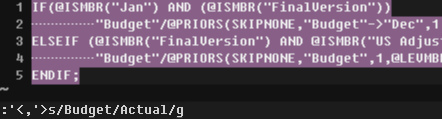

# Vi/Vim 替换

Vi/Vim 是程序员最常用的工具之一，尤其是 unix/linux 上；而替换也是最频繁的操作之一。

## 问题

在图形化编辑器中我们经常使用的替换功能在 vi/vim 中能实现吗？

答案是肯定的，并且功能绝对会让你满意。

## Vi/Vim 实战

vim 的模式有：命令模式，编辑模式，还有一种叫可视模式（也属于命令模式吧）

替换属于命令模式下的操作，请确保在命令模式下执行(多按几下 `Esc` 键即可)

最常用的替换：

	:%s/old/new/g
	# 替换全文的old为new

`s` 表示替换(substitute)，`g` 表示全行(global)，`%` 作用等同于`g`，不过指全文。

同一种操作可以有多种命令格式的选择，我觉得完全没必要增加记忆的负担，记住一种解决方案就好。

替换命令的格式：

	:[range] s/search/replace/[flags]

其中，range是指定范围，也就是在哪些行里做替换。

其他的标记（flags）包括：p（print），是否要求打印所做的改动；c（confirm），是否要求在做出改动以前先询问；i（ignorecase），是否不区分大小写。我们可以组合使用标记。

	:1,$ s/Professor/Teacher/gc
	
	replace with Teacher (y/n/a/q/l/^E/^Y)?

这时你可以做出以下回答：

- `y` Yes：执行这个替换
- `n` No：取消这个替换
- `a` All：执行所有替换而不要再询问
- `q` Quit：退出而不做任何改动
- `l` Last：替换完当前匹配点后退出
- `CTRL+E` 向上翻滚一行
- `CTRL+Y` 向下翻滚一行

### 将当前行的第一个匹配到字符替换

> 文本

	hello hello
	this is helloj bill
	[光标位置]jack say hello to hello
	
	aa ab ac
	aaa aaaa

将第一个 `hello` 替换为 `hi`，光标位置在jack前。

	:s/hello/hi/

> 新文本

	hello hello
	this is helloj bill
	[光标位置]jack say hi to hello
	
	aa ab ac
	aaa aaaa

1处被替换。

### 将当前行的所有匹配到字符替换

> 文本

	hello hello
	this is helloj bill
	[光标位置]jack say hello to hello
	
	aa ab ac
	aaa aaaa

将光标所在行所有 `hello` 替换为 `hi`。

	:s/hello/hi/g

> 新文本

	hello hello
	this is helloj bill
	[光标位置]jack say hi to hi
	
	aa ab ac
	aaa aaaa

2处被替换。

### 将所有行第一个匹配到字符替换

> 文本

	hello hello
	this is helloj bill
	[光标位置]jack say hello to hello
	
	aa ab ac
	aaa aaaa

将所有行第一个 `hello` 替换为 `hi`。

	:%s/hello/hi/

> 新文本

	hi hello
	this is hij bill
	[光标位置]jack say hi to hello
	
	aa ab ac
	aaa aaaa

3处被替换。

### 将所有行所有匹配到字符替换

> 文本

	hello hello
	this is helloj bill
	[光标位置]jack say hello to hello
	
	aa ab ac
	aaa aaaa

将所有行所有 `hello` 替换为 `hi`。

	:%s/hello/hi/g

> 新文本

	hi hi
	this is hij bill
	[光标位置]jack say hi to hi
	
	aa ab ac
	aaa aaaa

5处被替换。

### 指定行范围替换字符

> 文本

	hello hello
	this is helloj bill
	[光标位置]jack say hello to hello
	
	aa ab ac
	aaa aaaa

将第一行到第二行第一个 `hello` 替换为 `hi`。

	:1,2s/hello/hi/

> 新文本

	hi hello
	this is hij bill
	[光标位置]jack say hi to hello
	
	aa ab ac
	aaa aaaa

2处被替换。

其他更多行范围选择：

- `1,$`：第一行到最后一行
- `.,$`：当前行（包含）到最后一行
- `.,8`：当前行到第八行（得有交叉哟）
- `.,.+8`：当前行到下面的八行
- `.,$-4`：当前行到倒数第四行（倒数第四行不包含）
- `.-8,$`：当前往前8行到最后

更多合理的操作都可以，至于包含不包含，自己测试一下。

### 指定特定字符作为替换范围进行替换

> 文本

	hello hello
	this is helloj hello bill
	[光标位置]jack say hello to hello
	
	aa ab ac
	aaa aaaa

我想把 `this` 到 `to` 之间的所有 `hello` 替换为 `hi`。

	:/this/,/to/s/hello/hi/

> 新文本

	hello hello
	this is hij hello bill
	[光标位置]jack say hi to hello
	
	aa ab ac
	aaa aaaa

2处被替换

**注意**对于我的这个例子使用 `:/this/,/to/s/hello/hi/g` 会将 `to` 后的那个 `hello` 也替换掉。

### 精确替换

> 文本

	hello hello
	[光标位置]this is helloj hello jhello hellojokehello bill
	jack say hello/ to hello
	
	aa ab ac
	aaa aaaa

我只想替换当前行的 `hello` 开始的，使用 `\<`， `hello` 结束的，使用 `\>`，`hello` 这个单词（精确），见例子：

	:s/\<hello\>/hi/g

> 新文本

	hello hello
	[光标位置]this is helloj hi jhello hellojokehello bill
	jack say hello/ to hello
	
	aa ab ac
	aaa aaaa

1处被替换。

### 特殊字符替换

> 文本

	hello hello
	this is helloj hi jhello hellojokehello bill
	jack say hello/ to hello
	
	aa ab ac
	aaa aaaa

我需要将 `hello/` 替换掉。

你能想到的首先就是转义呗，嗯，可以的。

	:s/hello\//hi/g

这里多说一点，你还可以使用 `#` 或 `+` 或 `!` 作为分隔符，那么 `/` 将被保留了。

	:s#hello/#hi#g
	# or
	:s+hello/+hi+g
	# or
	:s!hello/!hi!g

> 新文本

	hello hello
	this is helloj hi jhello hellojokehello bill
	jack say hi to hello
	
	aa ab ac
	aaa aaaa

### 可视模式区域选择替换

在可视化模式下，首先选择替换范围, 然后输入 `:` 进入命令模式，就可以利用 `s` 命令在选中的范围内进行文本替换。

### 高富帅操作（正则表达式）

> 文本

	<a href="/celebrity/1049850/">梅莉莎·罗森伯格</a>

将 `<a>` 标签去掉，只留人名。

	:s/<a href.\{-}>\(.\{-}\)<\/a>/\1/g

> 新文本

	梅莉莎·罗森伯格

有点高端，其实就是正则表达式了。

**常用正则表达式**

- `.` 匹配任意一个字符
- `[abc]` 匹配方括号中的任意一个字符。可以使用`-`表示字符范围，如`[a-z0-9]`匹配小写字母和阿拉伯数字
- `[^abc]` 在方括号内开头使用`^`符号，表示匹配除方括号中字符之外的任意字符
- `\d` 匹配阿拉伯数字，等同于`[0-9]`
- `\D` 匹配阿拉伯数字之外的任意字符，等同于`[^0-9]`
- `\x` 匹配十六进制数字，等同于`[0-9A-Fa-f]`
- `\X` 匹配十六进制数字，等同于`[^0-9A-Fa-f]`
- `\w` 匹配单词字母，等同于`[0-9A-Za-z_]`
- `\W` 匹配单词字母之外的任意字符，等同于`[^0-9A-Za-z_]`
- `\t` 匹配`<TAB>`字符
- `\s` 匹配空白字符，等同于`[ \t]`
- `\S` 匹配非空白字符，等同于`[^ \t]`
- `\a` 所有的字母字符. 等同于`[a-zA-Z]`
- `\l` 小写字母 `[a-z]`
- `\L` 非小写字母 `[^a-z]`
- `\u` 大写字母 `[A-Z]`
- `\U` 非大写字母 `[^A-Z]`

**表示数量的元字符**

- `*` 匹配 0-任意个
- `\+` 匹配 1-任意个
- `\?` 匹配 0-1个
- `\{n,m}` 匹配 n-m个
- `\{n}` 匹配 n个
- `\{n,}` 匹配 n-任意个
- `\{,m}` 匹配 0-m个
- `\_.` 匹配包含换行在内的所有字符
- `\{-}` 表示前一个字符可出现零次或多次，但在整个正则表达式可以匹配成功的前提下，匹配的字符数越少越好
- `\=` 匹配一个可有可无的项
- `\_s` 匹配空格或断行
- `\*` 匹配 * 字符
- `\.` 匹配 . 字符
- `\/` 匹配 / 字符
- `\\` 匹配 \ 字符
- `\[` 匹配 [ 字符

**表示位置的符号**

- `$` 匹配行尾
- `^` 匹配行首
- `\<` 匹配单词词首
- `\>` 匹配单词词尾
- `\<\>` 精确匹配单词

**替换变量**

在正规表达式中使用 `\(` 和 `\)` 符号括起正规表达式，即可在后面使用`\1`、`\2`等变量来访问 `\(` 和 `\)` 中的内容。

**懒惰模式**

- `\{-n,m}` 与`\{n,m}`一样，尽可能少次数地重复
- `\{-}` 匹配它前面的项一次或多次, 尽可能地少
- `\|` "或"操作符
- `\&` 并列

**函数式**

	:s/替换字符串/\=函数式

在函数式中可以使用 `submatch(1)`、`submatch(2)` 等来引用 `\1`、`\2` 等的内容，而`submatch(0)`可以引用匹配的整个内容。

#### 参考示例

##### 提取标签文本

	:s/<a href.\{-}>\(.\{-}\)<\/a>/\=submatch(1)/g

##### 删除只有空白的行

	:g/^\s*$/d

##### 将 data1 data2 修改为 data2 data1

	:s/\(\w\+\)\s\+\(\w\+\)/\2\t\1

##### 将各行的 id 字符串替换为行号

	:%s/\<id\>/\=line(".")

##### 将每行开头的单词替换为`(行号-10).单词`的格式,如第11行的`word`替换成`1. word`

	:%s/\(^\<\w\+\>\)/\=(line(".")-10) .".". submatch(1)

##### 去掉所有的行尾空格和制表符

	:%s/\s\+$//

##### 查找开头和结尾处a的个数相同的字符串

	:/\(a\+\)[^a]\+\1

如： aabbbaa，aaacccaaa，但是不匹配 abbbaa

##### 将URL替换为`<a href="http://url">http://url</a>`的格式

	:s/\(http:\/\/[-a-z\._~\+%\/]\+\)/<a href="\1">\1<\/a>/

##### 在每一行头上加入一个空格。

	:%s/^/ /

##### 去掉所有的 `//` 注释内容

	:%s/\s*\/\/.*//g
	# 此处/可以用!替换
	:%s!\s*/\*\_.\{-}\*/\s*!!g

##### 去掉所有的 `/**/` 注释

	:%s!\s*/\*\_.\{-}\*/\s*! !g

`\_.` 匹配包含换行在内的所有字符；`\{-}` 表示前一个字符可出现零次或多次，但在整个正则表达式可以匹配成功的前提下，匹配的字符数越少越好；替换的结果是个空格的目的是保证像 `int main()` 这样的表达式在替换之后仍然是合法的。

##### 删除行尾的`^M`

有时候，在 Linux 中使用打开曾在 Windows 中编辑过的文件时，会在行尾看到 `^M` 字符.

	:%s/^M$//g

**注意** `^` 指 `Ctrl + v` , `M` 指 `Ctrl + m`

示例来自互联网，部分示例没有实际测试，仅供参考。

## 参考资料

- [VIM学习笔记 替换(Substitute)（被GFW了）](http://yyq123.blogspot.com/2011/10/vim-substitute.html)
- [vim 中如何替换选中行或指定几行内的文本（转的上面的）](http://segmentfault.com/q/1010000002552573/a-1020000002552589)
- [vi 查找替换使用方法](http://wzgyantai.blogbus.com/logs/28117977.html)
- [vim查找替换小结](http://nodex.iteye.com/blog/360709)
- [磨刀不误砍柴工以及VIM中正则的非贪婪匹配](http://blog.sina.com.cn/s/blog_64898a710100stqd.html)